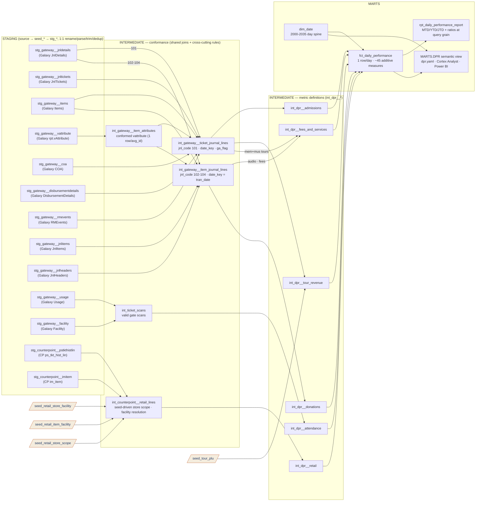

# DPR Lineage — Table Relationships & Transformations

> **Scope:** the live Daily Performance Report slice — Gateway (Galaxy) ticketing and
> NCR CounterPoint retail, from source extract to `MARTS.DPR` semantic view.
> Other sources/domains are target-state and `enabled=false`; see `ARCHITECTURE_FLOW.md`.

> **Source of truth:** built from the actual repo models (`ns11mm/ns11mm-data-platform`, v1.5.0)
> **Last updated:** July 2026  ·  Jeremy Myers, VP of AI & Analytics
> **Companion:** `dpr_metric_reconciliation_audit_v3.xlsx` (legacy parity evidence)

---

## End-to-end flow



Reading the graph: each staging node collapses its 1:1 chain (source table → `seed_*` →
`stg_*` model) into one box, so the drawn edges are the real topology — joins into the two
conformance journals, facility resolution for CounterPoint, and the fan-in of all six
metric models onto the `fct_daily_performance` day spine. Cream nodes are reference seeds.
Edge labels carry the defining filter (`101`, `102-104`) where one source feeds two models.

---

## What each step transforms

### 1. Source → RAW seeds (`seed_gate_*`, `seed_cp_*`)

Interim ingestion: `bcp` extracts of the SQL Server base tables loaded as CSVs into the
`RAW` schema. **No transformation** — RAW is immutable and write-once (ADR-001). Two known
extract artifacts live at this layer (not introduced by dbt): `disbursement_id` and
`order_line_id` arrive as literal `0`, and the COA extract is missing the accounts behind
journal codes 33/35/37/52. See CHANGELOG 1.5.0 Known Issues.

### 2. RAW → Staging (`stg_<source>__<entity>`)

One model per base table. Transformations are **shape-only** — no business logic:

| Transformation | Examples |
| --- | --- |
| Rename to snake_case | `JnlcodeID → jnl_code_id`, `auxtableid → aux_table_id`, `datesold → sold_at` |
| Type coercion, safe parsing | `try_to_timestamp(datesold)`, `try_to_timestamp(endoflifedate)` — unparseable values become NULL, never errors |
| Key normalization | `trim(plu)` in `stg_gateway__items` / `__jnltickets` / `__jnlitems` — Galaxy pads `plu` to `CHAR(20)`; untrimmed keys silently defeat every downstream equality join (1.5.0) |
| Deduplication | `QUALIFY row_number()` on the natural key, latest `_loaded_at` wins |
| Load metadata | `_loaded_at` carried on every row |

Parse-health facts worth knowing: `jnltickets.ticketdate` is ~95% unparseable (never rely
on it alone); `datesold` parses 100%; `endoflifedate` ~80% and is the canonical visit date;
`jnlheaders.trandate` parses 100%.

### 3. Staging → Intermediate (conformance layer)

This is where the shared join topology and cross-cutting business rules live, so the
`int_dpr__*` metric models can filter instead of re-joining.

**`int_gateway__ticket_journal_lines`** — one row per ticket line (`jnl_code_id = 101`).

```
jnldetails (101) ──┬── inner join jnltickets   on jd.aux_table_id = jt.jnl_detail_id   (ticket bridge: plu, order, event, dates)
                   ├── inner join items        on jt.plu = it.plu                      (catalog: description, kind, cost, price)
                   ├── inner join int_gateway__item_attributes                          (conformed vattribute — matrix code,
                   │              on it.attribute_value_group_id = va.avg_id            recognize basis, default customer)
                   ├── inner join coa          on jd.account_id = c.account_id         (GL context)
                   ├── left  join disbursement (via coa gl/company/category keys)      (GEN ADM name)
                   └── left  join rmevents     on rme.event_id = jt.event_no           (event start date)
```

The vattribute join goes through **`int_gateway__item_attributes`** (one row per
`avg_id`), which conforms `stg_gateway__vattribute` once for both journal models.

Derivations:
- **`date_key`** — the recognized reporting date, via the `gateway_recognized_date` macro.
  Recreates Galaxy recognize-basis logic with visit-date fallbacks (all bases coalesce to
  `end_of_life_date` because `rme.start_at` and `ticketdate` are unreliable in the extract):
  basis 182 → `coalesce(start_at, end_of_life_date, ticket_date)`; 185/else →
  `coalesce(ticket_date, end_of_life_date)`; 349 → `sold_at + 14 days`.
- **`ga_flag`** — general admission (1) vs tour/other (0), via
  `gateway_general_admission_flag`: `disbursement_id = 0` + matrix `GAD%` → GA. (The
  second branch — tour ticket sold with GA — is dead while `disbursement_id` is zeroed.)
- **Row filters** — drop `date_key is null` (voids/sentinels with no usable date), the
  `EXTEVENTAD001` placeholder, and comp customers 20056/23361 (intended legacy exclusion).

Verified conservation (July 2026 extract): raw 101 journal = 127,694 qty / $3.68M →
enriched journal = 105,781 / $2.94M (residual = comp exclusion 7,885 + null-date
sentinels) → GA 96,326 / $2.68M + tours/passes 9,455 / $262K, **a clean partition to the
penny**. Any future drift between these stages is a bug, not a definition change.

**`int_gateway__item_journal_lines`** — one row per item line (`jnl_code_id` 102–104).
Same catalog joins (via the `jnlitems` bridge `jd.aux_table_id = ji.jnl_item_id`, and
`int_gateway__item_attributes` for the attribute set);
`date_key = jnlheaders.tran_date` (transaction/fiscal date — item lines do not use
recognize-basis logic).

**`int_counterpoint__retail_lines`** — one row per CP sale/return line. Store scope is
**seed-driven**: `where store_id in (select store_id from seed_retail_store_scope)`
(currently stores 1, 3, 8–14 — edit the seed, not the model, to change scope).
Derives `key_facility` with legacy `t_fact_retail` precedence:
**item override first** (`seed_retail_item_facility`: e.g. `201114 → 1040` MAG,
`201197 → 1060` MUS AG), **then store fallback** (`seed_retail_store_facility`:
8/9/10 → 1003 Museum Store, 11–14 → 1020 Carts, 3 → 1234 Ecom, 1 → 4007 Cafe). Splits
measures into `sale_amount` / `return_amount` / costs.

**`int_ticket_scans`** — valid gate scans from `usage`, joined to `facility` for
area classification.

### 4. Intermediate → `int_dpr__*` (metric definitions)

Each model filters the conformed lines into DPR line items — **this is the only layer
where a metric's definition lives** (ADR-004: nothing in Power BI, ADR-005: metric gate).

| Model | Reads | Defines (filter → measure) |
| --- | --- | --- |
| `int_dpr__admissions` | ticket journal | `ga_flag = 1` → `tickets_sold`, `ticket_revenue`, `mus_attendance` (proxy); matrix `%CPA%/%CPB%` → `pass_revenue` |
| `int_dpr__tour_revenue` | ticket journal + `seed_tour_plu` | matrix `%TOU%` minus seed PLUs → `mus_guided_*`; `%MGT%` → `mem_guided_*`; seed labels → field trips, revealed, ask-educator; matrix `%VTM%/%VTU%/%VTF%` → virtual tours |
| `int_dpr__fees_and_services` | both journals | PLU list `MUSMMUADW001/003/005` (product 178) → `mem_mus_tour_*`; matrix `FEE-…-MUF/MEF` → `service_fees`; PLUs `AUDIO1001/0001` kind 8 → `audio_tour_headset`; matrix `%MAG%` → memorial audio (Galaxy portion) |
| `int_dpr__donations` | item journal | matrix `%MUS%+%DON%` with exclusions (`%OPS-MEM%`, `%OPS-MUS%`, member desk `DONMBRMUS001`) → `ticketing_donations`; PLUs `DONOPSMEM003` / `DONOPSMUS003` → box-office lines; matrix `%DON-OPS-MUS%` excl. exit-box PLU → `coatcheck_don` |
| `int_dpr__retail` | CP retail lines | facility 1003 → store profit + donations (excl. exit-box item); 1020 + item `7-999` → `cart_donation_ask`; item `101375` → `mus_exit_donations`; items `200704` / `101165` → `mask_donations` / `donation_box`; 4007 → cafe; 1234 → ecom ask; 1040 → `mag_cp_revenue`; 1060 → MUS AG |
| `int_dpr__attendance` | ticket scans | facility classification → `mem_attendance`, `mus_attendance_scanned` |

Aggregation grain everywhere: **one row per `date_key`**, all measures additive `SUM`s.

> **Naming note (honest):** model outputs standardize on `date_key`; the legacy
> `key_date` name survives only as the **source column** in the 911dw-style budget
> seed tables (`int_budget__*` cast `KEY_DATE` → `date_key`), and the legacy `key_`
> prefix lives on in `key_facility` (the 911dw selling-area surrogate). Earlier
> revisions of this doc used `key_date` for the model outputs — that was stale.

### 5. `int_dpr__*` → Fact → Report → Semantic

- **`fct_daily_performance`** — full-outer joins the six `int_dpr__*` models on
  `date_key`, inner joins `dim_date` (2000–2035), `coalesce(…, 0)` on every measure.
  One row per day, ~45 additive measures. Cross-source combinations happen here (e.g.
  `mem_audio_guide_revenue` = Galaxy `%MAG%` + CP `mag_cp_revenue`;
  `audio_tour_headset` = Galaxy units + CP fac-1060). **No ratios** — additive only.
- **`rpt_daily_performance_report`** — presentation layer: period roll-ups (MTD/YTD/JTD)
  computed on demand at query time, ratios (`avg_ticket_price`,
  `mus_store_rev_per_visitor`) as ratio-of-sums at the query grain (never averaged
  across days), display ordering. No new business logic.
- **`MARTS.DPR` semantic view** — authored in `cortex_project/DPR.sv.yaml` (DDL generated
  by `scripts/generate_semantic_view_ddl.py`): 49 metrics over `fct_daily_performance` ×
  `dim_date`, with the calendar dimension set (calendar-only today; fiscal calendar
  pending Data & AI Committee definition). Serves Cortex Analyst natural-language queries
  and is the single semantic contract for Power BI (display-only per ADR-004).

---

## Reading lineage for one metric (worked example)

`donation_box` = **CounterPoint** `ps_tkt_hist_lin` → `seed_cp_pstkthistlin` →
`stg_counterpoint__pstkthistlin` (rename/dedup) → `int_counterpoint__retail_lines`
(store scope + facility resolution + sale/return split) → `int_dpr__retail`
(`item_no = '101165'` → measure, summed per `date_key`) → `fct_daily_performance`
(coalesced onto the day spine) → `rpt_` / `MARTS.DPR`.

The reconciliation audit workbook carries this crosswalk for every metric, including the
legacy Pentaho transform each one replaces.

---

## Known caveats at each layer (July 2026)

| Layer | Caveat |
| --- | --- |
| Extract | Recent-window only (CP: Jun 1–Jul 6); `disbursement_id`/`order_line_id` zeroed; COA gaps for codes 33/35/37/52 (service fees unidentifiable); CP stores 8/10 absent; `rmevents.start_at` null for basis-182 rows |
| Staging | `ticketdate` ~95% unparseable by design — never key on it without the `end_of_life_date` fallback |
| Intermediate | `ga_flag` tour-with-GA branch dead until `disbursement_id` is fixed; unissued population (present in `orderlines`, 5,703 units / $1.9M) not yet modeled — pending ADR-005 |
| Marts | `tickets_sold`/`ticket_revenue` are the issued-GA definition (unissued/CityPASS/bulk/child-subtraction pending ADR-005); `mus_attendance` is a GA-ticket proxy, not scans |
| Semantic | Native DDL twin `scripts/deploy_semantic_view_dpr.sql` is generated from `cortex_project/DPR.sv.yaml` by `scripts/generate_semantic_view_ddl.py` (drift-guarded by the pre-commit hook) |