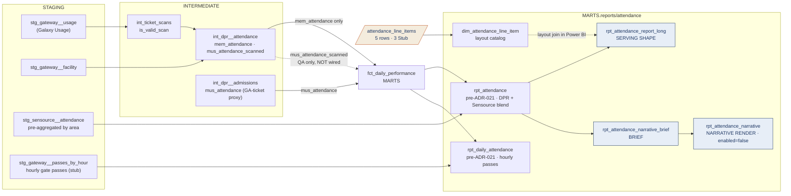

# Attendance Lineage — Table Relationships & Transformations

> **Family:** `models/marts/reports/attendance/` (6 models — the Attendance Report and the
> Daily Attendance Report)
> **Source of truth:** built from the actual repo models (`ns11mm/ns11mm-data-platform`, v7.13.0)
> **Last updated:** August 2026 · Jeremy Myers, VP of AI & Analytics
> **Index:** [`LINEAGE_INDEX.md`](LINEAGE_INDEX.md) · **Role grammar:** ADR-021

The family with the most careful epistemics in the platform, because attendance can be
counted three ways and the platform deliberately refuses to collapse them into one number.
It is also the only family with **no semantic-view wrapper**: its serving models read the
presentation view directly, because no semantic view covers what it blends.

---

## End-to-end flow

The dotted line is the important one: `mus_attendance_scanned` is computed and
**deliberately not wired downstream**.

---

## Three counts of the same thing

| Count | Where it comes from | Where it lands |
| --- | --- | --- |
| **`mus_attendance`** — museum attendance | `int_dpr__admissions`, a **GA-ticket proxy** (one issued general-admission ticket = one visitor) | `fct_daily_performance`, the DPR, and this report's `museum_attendance` |
| **`mem_attendance`** — memorial attendance | `int_dpr__attendance`, from **valid gate scans** classified by facility name | `fct_daily_performance` and this report's `memorial_attendance` |
| **`mus_attendance_scanned`** | `int_dpr__attendance`, the same scan classification applied to museum facilities | **Nowhere.** It exists to QA the GA-ticket proxy |

The third row is a design decision, not an oversight. Wiring `mus_attendance_scanned`
downstream would create a second, disagreeing definition of museum attendance in the same
fact — the exact failure ADR-018 exists to prevent. It stays available for reconciliation
and out of the serving path.

The facility classification itself is a `LIKE` match on `facility_name`
(`'%MEMORIAL%'` / `'%PLAZA%'` → memorial, `'%MUSEUM%'` → museum), flagged in the model
header as an ADR-005 scope gate pending confirmation from Kenny Yeung and Chris Wogas.

**Sensource is a fourth, independent lineage.** `stg_sensource__attendance` arrives
pre-aggregated by named area — no facility mapping needed — carrying `memorial_only`,
`mus_store` and `mus_store_vesey`. `rpt_attendance` left-joins it onto the DPR measures on
`date_value = date_key`. Sensource also carries its own `mem_attendance` and
`mus_attendance` columns; the model pulls them into a CTE but **never selects them** — the
DPR figures win. Those two CTE columns are dead and could be dropped.

**The hourly path.** `rpt_daily_attendance` sums `stg_gateway__passes_by_hour` by day and
falls back to the DPR figure when the feed is empty:
`museum_attendance = coalesce(passes, mus_attendance)`. `passes_by_hour_total` is carried
raw and un-coalesced, so you can always tell which side of the `coalesce` you are reading.

---

## Model inventory

| Model | Role | Materialization | Grain |
| --- | --- | --- | --- |
| `rpt_attendance` | pre-ADR-021 | view | 1 row / date |
| `rpt_daily_attendance` | pre-ADR-021 | view | 1 row / date |
| `rpt_attendance_report_long` | Serving shape | view | date × line item |
| `rpt_attendance_narrative_brief` | Deterministic brief | view | 1 row / date |
| `rpt_attendance_narrative` | Narrative render (Cortex) | **`enabled=false`** | 1 row / date |
| `dim_attendance_line_item` | Layout catalog | table | 5 rows (3 Stub) |

The three newer models were built in 7.12.0, six days before ADR-021 was written. The role
grammar codified the names that had already emerged; nothing was renamed.

---

## Semantic view coverage — and the gap

`cortex_project/ATTENDANCE.sv.yaml` does **not** cover this family. Its six tables are
`FCT_DAILY_SCAN`, `FCT_TICKET_DEMAND_FORECAST`, `FCT_TICKET_AVAILABILITY`,
`FCT_TODAY_SALES_HOURLY`, `DIM_DATE` and `SEED_SCAN_MARKET_SEGMENT` — there is no reference
to `FCT_DAILY_PERFORMANCE`, to either presentation view, or to the Sensource and hourly
staging models. Despite the name, it is the Daily Scan Report's view.

The DPR-sourced attendance measures do have a conversational surface: `UNIFIED` carries
`total_museum_attendance` and `total_memorial_attendance` over `FCT_DAILY_PERFORMANCE`.
What has **no** natural-language surface anywhere is the part that makes this report
distinct — the Sensource plaza and store counts, and the hourly passes total.
`report_semantic_view_map.md` marks both reports "⚠️ partial" for exactly this reason.

That is also why there is no `rpt_attendance_powerbi` wrapper: with nothing to wrap, the
serving shape reads `rpt_attendance` directly.

---

## Serving shape

`rpt_attendance_report_long` unpivots five line items — `MEM_ATTENDANCE`,
`MUS_ATTENDANCE`, `MEMORIAL_ONLY`, `MUSEUM_STORE`, `MUSEUM_STORE_VESEY` — at date × line
item. All are additive, so there are no ratio columns.

It also carries **no budget columns at all**, and the header says why: this report has no
goals, so the columns are omitted entirely rather than carried NULL. That is a deliberate
departure from the typed-NULL convention, which applies to columns the legacy artifact
actually prints. Worth knowing before you go looking for a budget seam that was never there.

The two older presentation views zero-fill their Sensource gaps with `coalesce(..., 0)`
rather than typed NULL — they predate the convention. The three Sensource line items are
marked `availability = 'Stub'` in the seed, which is how Power BI knows to grey them.

---

## Narrative chain

`rpt_attendance_narrative_brief` computes day-over-day and same-weekday-last-week deltas
with `lag()`, and year-over-year by an explicit self-join to the same calendar date rather
than a lag — the spine may have gaps, and a positional lag would silently compare the wrong
days. Its 7-day direction flag classifies rising / falling / flat / `insufficient_history`
from a ±5% band on the trailing-7 vs prior-7 average.

It **excludes the Sensource store-visitor stubs** on the same principle used across the
platform: the LLM cannot narrate a stub.

`rpt_attendance_narrative` is `enabled=false` and documents the Cortex call deployed by
`scripts/setup_attendance_narrative.sql` as `MARTS.T_ATTENDANCE_NARRATIVE` (05:30 ET,
`MONITORING_WH`, created suspended). Consumers read `MARTS.ATTENDANCE_PBI_NARRATIVE`. The
prompts in the model and the script carry matching sync-guard comments and are currently
identical.

---

## Caveats (August 2026)

| Layer | Caveat |
| --- | --- |
| Classification | The memorial-vs-museum facility classification in `int_dpr__attendance` is a name-pattern match awaiting ADR-005 sign-off |
| Feeds | Sensource plaza and store counts are stub-zeroed pending the real feed; the hourly-passes feed is stub, with the scan/admissions fallback active |
| By design | `mus_attendance_scanned` is intentionally not wired downstream. Do not "fix" this without a metric-gate decision |
| Dead code | `rpt_attendance` pulls Sensource's own `mem_attendance` / `mus_attendance` into a CTE and never selects them |
| Semantic | The Sensource blend and the hourly total have no Cortex Analyst surface at all |
| Exposures | `pentaho_attendance` (RPT-011) and `pentaho_daily_attendance` (RPT-012, disposition CONSOLIDATE) both point at `fct_daily_performance`. RPT-012's stated target also cites `fct_daily_scan`, but its `depends_on` is pinned to the one enabled `ref()` |
| Governance | ADR-021 is `Proposed` |

---

## Related documents

- **Index:** [`LINEAGE_INDEX.md`](LINEAGE_INDEX.md)
- **Where `mus_attendance` is actually defined:** [`../DPR_LINEAGE.md`](../DPR_LINEAGE.md)
- **The report the ATTENDANCE semantic view really serves:** [`SCAN_LINEAGE.md`](SCAN_LINEAGE.md)
