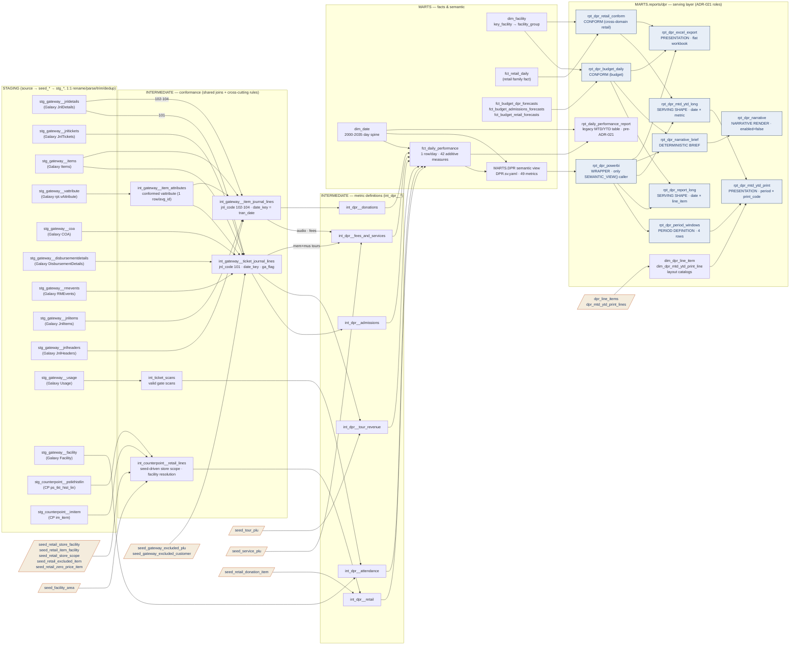

# DPR Lineage — Table Relationships & Transformations

> **Scope:** the Daily Performance Report family — Gateway (Galaxy) ticketing and
> NCR CounterPoint retail, from source extract through `MARTS.DPR` to the thirteen
> models in `models/marts/reports/dpr/`.
> Other sources/domains are target-state and `enabled=false`; see `ARCHITECTURE_FLOW.md`.

> **Source of truth:** built from the actual repo models (`ns11mm/ns11mm-data-platform`, v7.13.0)
> **Last updated:** August 2026  ·  Jeremy Myers, VP of AI & Analytics
> **Companions:** `lineage/LINEAGE_INDEX.md` (the other six report families) ·
> `dpr_metric_reconciliation_audit_v3.xlsx` (legacy parity evidence)

**What changed since the July 2026 revision.** The upstream half of this document
(source → staging → intermediate → `fct_daily_performance`) is substantially unchanged
and still correct. The downstream half is new: the DPR no longer ends at one `rpt_`
model. Under **ADR-021** it is a wrapper plus seven role-named serving models, and the
Excel MTD/YTD variants and the AI narrative chain hang off that wrapper. Cross-cutting
exclusions that were hardcoded in July are now seed-driven.

---

## End-to-end flow



Reading the graph: each staging node collapses its 1:1 chain (source table → `seed_*` →
`stg_*` model) into one box, so the drawn edges are the real topology. Cream nodes are
reference seeds; blue nodes are ADR-021 role models. The two things to notice are the
**fan-in** — six `int_dpr__*` models onto the `fct_daily_performance` day spine — and the
**fan-out** — one wrapper (`rpt_dpr_powerbi`) feeding every serving model. Every arrow in
the serving box points *rightward through the ADR-021 chain*; an arrow pointing back the
other way would be a defect.

---

## What each step transforms

### 1. Source → RAW seeds (`seed_gate_*`, `seed_cp_*`)

Interim ingestion: `bcp` extracts of the SQL Server base tables loaded as CSVs into the
`RAW` schema. **No transformation** — RAW is immutable and write-once (ADR-001, ADR-007).
Two known extract artifacts live at this layer (not introduced by dbt): `disbursement_id`
and `order_line_id` arrive as literal `0`, and the COA extract is missing the accounts
behind journal codes 33/35/37/52.

### 2. RAW → Staging (`stg_<source>__<entity>`)

One model per base table, materialized as views in `STAGING`. Transformations are
**shape-only** — no business logic:

| Transformation | Examples |
| --- | --- |
| Rename to snake_case | `JnlcodeID → jnl_code_id`, `auxtableid → aux_table_id`, `datesold → sold_at` |
| Type coercion, safe parsing | `try_to_timestamp(datesold)`, `try_to_timestamp(endoflifedate)` — unparseable values become NULL, never errors |
| Key normalization | `trim(plu)` in `stg_gateway__items` / `__jnltickets` / `__jnlitems` — Galaxy pads `plu` to `CHAR(20)`; untrimmed keys silently defeat every downstream equality join |
| Deduplication | `QUALIFY row_number()` on the natural key, latest `_loaded_at` wins |
| Load metadata | `_loaded_at` carried on every row |

Parse-health facts worth knowing: `jnltickets.ticketdate` is ~95% unparseable (never rely
on it alone); `datesold` parses 100%; `endoflifedate` ~80% and is the canonical visit date;
`jnlheaders.trandate` parses 100%.

### 3. Staging → Intermediate (conformance layer)

This is where the shared join topology and cross-cutting business rules live, so the
`int_dpr__*` metric models can filter instead of re-joining.

**`int_gateway__ticket_journal_lines`** — one row per ticket line (`jnl_code_id = 101`).

```
jnldetails (101) ──┬── inner join jnltickets   on jd.aux_table_id = jt.jnl_detail_id   (ticket bridge: plu, order, event, dates)
                   ├── inner join items        on jt.plu = it.plu                      (catalog: description, kind, cost, price)
                   ├── inner join int_gateway__item_attributes                          (conformed vattribute — matrix code,
                   │              on it.attribute_value_group_id = va.avg_id            recognize basis, default customer)
                   ├── inner join coa          on jd.account_id = c.account_id         (GL context)
                   ├── left  join disbursement (via coa gl/company/category keys)      (GEN ADM name)
                   └── left  join rmevents     on rme.event_id = jt.event_no           (event start date)
```

The vattribute join goes through **`int_gateway__item_attributes`** (one row per
`avg_id`), which conforms `stg_gateway__vattribute` once for both journal models.

Derivations:

- **`date_key`** — the recognized reporting date, via the `gateway_recognized_date` macro
  (`macros/operations/`). Recreates Galaxy recognize-basis logic with visit-date fallbacks
  (all bases coalesce to `end_of_life_date` because `rme.start_at` and `ticketdate` are
  unreliable in the extract): basis 182 → `coalesce(start_at, end_of_life_date, ticket_date)`;
  185/else → `coalesce(ticket_date, end_of_life_date)`; 349 → `sold_at + 14 days`.
- **`ga_flag`** — general admission (1) vs tour/other (0), via
  `gateway_general_admission_flag`: `disbursement_id = 0` + matrix `GAD%` → GA. (The
  second branch — tour ticket sold with GA — is dead while `disbursement_id` is zeroed.)
- **Row filters — now seed-driven.** Drop `date_key is null` (voids/sentinels with no
  usable date), plus `plu in seed_gateway_excluded_plu` (currently the `EXTEVENTAD001`
  placeholder) and `customer_id in seed_gateway_excluded_customer` (currently 20056 /
  23361, the intended legacy comp exclusion). These were literals in the model in July;
  edit the seed, not the model.

Verified conservation (July 2026 extract): raw 101 journal = 127,694 qty / $3.68M →
enriched journal = 105,781 / $2.94M (residual = comp exclusion 7,885 + null-date
sentinels) → GA 96,326 / $2.68M + tours/passes 9,455 / $262K, **a clean partition to the
penny**. Any future drift between these stages is a bug, not a definition change.

**`int_gateway__item_journal_lines`** — one row per item line (`jnl_code_id` 102–104).
Same catalog joins (via the `jnlitems` bridge `jd.aux_table_id = ji.jnl_item_id`, and
`int_gateway__item_attributes` for the attribute set);
`date_key = jnlheaders.tran_date` (transaction/fiscal date — item lines do not use
recognize-basis logic).

**`int_counterpoint__retail_lines`** — one row per CP sale/return line. Store scope is
**seed-driven**: `where store_id in (select store_id from seed_retail_store_scope)`
(currently stores 1, 3, 8–14 — store 1, the Museum Cafe, was added 2026-07-08).
Derives `key_facility` with legacy `t_fact_retail` precedence:
**item override first** (`seed_retail_item_facility`: e.g. `201114 → 1040` MAG,
`201197 → 1060` MUS AG), **then store fallback** (`seed_retail_store_facility`:
8/9/10 → 1003 Museum Store, 11–14 → 1020 Carts, 3 → 1234 Ecom, 1 → 4007 Cafe), defaulting
to 1020. Two more seeds trim the population: `seed_retail_excluded_item` drops lines
outright, `seed_retail_zero_price_item` zeroes their amounts. Lines whose description
matches `%shipping%` are dropped.

Netting is derived **once, here**, by addition — CounterPoint return (`R`) lines carry
negative `ext_price`/`qty`. Downstream models consume `net_amount` / `net_quantity` rather
than re-netting. (Prior to 7.9.0 `int_retail__performance` netted a second time and
doubled the effect of returns.)

**`int_ticket_scans`** — valid gate scans from `usage`; `int_dpr__attendance` joins
`stg_gateway__facility` for area classification.

### 4. Intermediate → `int_dpr__*` (metric definitions)

Each model filters the conformed lines into DPR line items — **this is the only layer
where a metric's definition lives** (ADR-004: nothing in Power BI, ADR-005: metric gate).

| Model | Reads | Defines (filter → measure) |
| --- | --- | --- |
| `int_dpr__admissions` | ticket journal | `ga_flag = 1` → `tickets_sold`, `ticket_revenue`, `mus_attendance` (proxy); matrix `%CPA%/%CPB%` → `pass_revenue` |
| `int_dpr__tour_revenue` | ticket journal + `seed_tour_plu` | matrix `%TOU%` minus seed PLUs → `mus_guided_*`; `%MGT%` → `mem_guided_*`; seed labels → field trips, revealed, ask-educator; matrix `%VTM%/%VTU%/%VTF%` → virtual tours |
| `int_dpr__fees_and_services` | both journals + `seed_service_plu` | seed `mem_mus_tour` PLUs (`MUSMMUADW001/003/005`, product 178) → `mem_mus_tour_*`; matrix `FEE-…-MUF/MEF` → `service_fees`; seed `mus_audio_guide` PLUs (`AUDIO1001/0001`, kind 8) → `audio_tour_headset`; matrix `%MAG%` → memorial audio (Galaxy portion) |
| `int_dpr__donations` | item journal | matrix `%MUS%+%DON%` with exclusions (`%OPS-MEM%`, `%OPS-MUS%`, member desk `DONMBRMUS001`) → `ticketing_donations`; PLUs `DONOPSMEM003` / `DONOPSMUS003` → box-office lines; matrix `%DON-OPS-MUS%` excl. exit-box PLU → `coatcheck_don` |
| `int_dpr__retail` | CP retail lines + `seed_retail_donation_item` | facility 1003 → store profit + donations; seeded donation items (`7-999` cart ask, `101375` museum exit, `200704` mask, `101165` plaza box); 4007 → cafe; 1234 → ecom ask; 1040 → `mag_cp_revenue`; 1060 → MUS AG |
| `int_dpr__attendance` | ticket scans + facility | facility-name classification → `mem_attendance`, `mus_attendance_scanned` |

Aggregation grain everywhere: **one row per `date_key`**, all measures additive `SUM`s.
The donation-item numbers that were literals in the model in July now live in
`seed_retail_donation_item`, carrying their legacy `dim_item_descr` IDs as provenance.

> **Naming note (honest):** model outputs standardize on `date_key`; the legacy
> `key_date` name survives only as the **source column** in the 911dw-style budget
> seed tables (`int_budget__*` cast `KEY_DATE` → `date_key`), and the legacy `key_`
> prefix lives on in `key_facility` (the 911dw selling-area surrogate).

### 5. `int_dpr__*` → Fact → Semantic view

- **`fct_daily_performance`** — full-outer joins the six `int_dpr__*` models on
  `date_key`, inner joins `dim_date` (2000–2035), `coalesce(…, 0)` on every measure.
  One row per day, 42 additive measures, `cluster_by=['date_key']`. Cross-source
  combinations happen here (e.g. `mem_audio_guide_revenue` = Galaxy `%MAG%` + CP
  `mag_cp_revenue`; `audio_tour_headset` = Galaxy units + CP fac-1060).
  **No ratios** — additive only.
- **`MARTS.DPR` semantic view** — authored in `cortex_project/DPR.sv.yaml` (DDL generated
  by `scripts/generate_semantic_view_ddl.py`): **49 metrics** over `fct_daily_performance`
  (`DP`) × `dim_date` (`DT`, 13 dimensions), calendar-only today; the fiscal calendar is
  pending a Data & AI Committee definition. Serves Cortex Analyst natural-language queries
  and is the single semantic contract for Power BI.

### 6. Semantic view → the serving layer (ADR-021)

Everything below the semantic view is **presentation**. Under ADR-021 each model takes one
of seven named roles, identified by its filename suffix, and may read only *leftward* in
the chain. The DPR family is the reference implementation of that grammar.

| Model | Role | Grain | What it does |
| --- | --- | --- | --- |
| `rpt_dpr_powerbi` | **Wrapper** | 1 row / `report_date` | The only permitted `SEMANTIC_VIEW()` caller in the family. Power BI's Snowflake connector cannot browse a `SEMANTIC VIEW` object, so this wraps the query in an ordinary view. Projection and aliasing only — no expressions. Non-additive ratios are deliberately **not** selected; DAX recomputes them from the summed components. |
| `rpt_dpr_budget_daily` | **Comparison conform** | 1 row / `report_date` | Conforms three budget facts (`fct_budget_dpr_forecasts` primary, `fct_budget_admissions_forecasts` facility-summed, `fct_budget_retail_forecasts` by selling area via `dim_facility.facility_group`) to the wrapper's column names, so actual and budget unpivot identically. Deliberately unpopulated: the two donation composites, Professional Program Revenue, Total Estimated Revenue, Virtual Tour Revenue. |
| `rpt_dpr_retail_conform` | **Comparison conform** (cross-domain) | 1 row / `report_date` | The retail sub-metrics `fct_daily_performance` does not carry — Museum Store visitors/customers/net sales, Carts customers/net sales, e-com orders, Cafe transactions — pivoted out of `fct_retail_daily` by `facility_group`. Carries `net_sales` *and* `net_profit` because the Excel export prints area **revenue** while the MTD/YTD reports print gross **profit**. Ratios are not computed here. |
| `rpt_dpr_period_windows` | **Period definition** | 4 rows (`period_group` × `scenario`) | MTD and YTD, each paired with its prior-year counterpart, as `[start_date .. end_date]`. Carries no measure. |
| `rpt_dpr_report_long` | **Serving shape** | 1 row / `report_date` × `line_item_code` | The daily DPR matrix: unpivots wrapper (actual) and budget conform into one tidy shape carrying both scenarios — `amount`/`numerator`/`denominator` for actual, `budget_*` for budget. Power BI joins `dim_dpr_line_item` for layout and `dim_date` for periods. |
| `rpt_dpr_mtd_ytd_long` | **Serving shape** | 1 row / `report_date` × `metric_code` | Every metric the MTD and YTD workbooks print, unpivoted to day grain so any period window can sum it. Additive metrics carry `amount`; the four ratios carry numerator and denominator. |
| `rpt_dpr_mtd_ytd_print` | **Presentation shape** | 1 row / `period_group` × `print_code` | The printed grid. Cross join of period groups × the 61 printed lines, LEFT joined to the windowed aggregate, resolving the workbooks' four columns: `actual`, `prior_year`, `variance_amount`, `variance_pct`. |
| `rpt_dpr_excel_export` | **Presentation shape** | 1 row / `report_date` | The flat "DPR Excel Data" workbook — one column per measure, actual paired with budget, column names and order following the workbook. |
| `rpt_dpr_narrative_brief` | **Deterministic brief** | 1 row / `report_date` | One JSON object per day of every fact the narrative may reference: actual vs budget for 19 headline lines, DoD / WoW / YoY, MTD/YTD context, 7-day direction flags, top budget and DoD movers. |
| `rpt_dpr_narrative` | **Narrative render** | 1 row / `report_date` | `snowflake.cortex.complete('claude-sonnet-4-6', …)` over the brief, structured JSON output. **`enabled=false`** — each `SELECT` costs tokens, so it is documentation and the source SQL for the deployed task, not a materialized view. |

Two supporting models sit alongside: **`dim_dpr_line_item`** (28 rows, from
`dpr_line_items`) is the daily report's layout catalog, and
**`dim_dpr_mtd_ytd_print_line`** (61 rows, from `dpr_mtd_ytd_print_lines`, 12 marked
`Stub`) is the MTD/YTD workbooks' printed-row catalog. Both live in the family directory
rather than `models/marts/dimensions/`, per ADR-021 §2.

**`rpt_daily_performance_report`** predates the role grammar and is the one model in the
family materialized as a `table` rather than a view. It reads `fct_daily_performance` +
`dim_date` directly and computes MTD/YTD as window sums partitioned by period, plus the
non-additive ratios at that grain. It is not part of the wrapper chain and does not read
the semantic view.

#### The three rules that keep this correct

**Ratios are never stored pre-divided.** A serving shape carries the numerator and the
denominator; the division happens once, at the grain being displayed. `MUS_STORE_CAPTURE_RATE`
carries `mus_store_visitors / museum_attendance` as two columns, not one. This is what makes
an MTD ratio a ratio-of-sums rather than an average of daily ratios, and it holds whether the
division lands in DAX or in SQL. Verified against the workbook: capture rate
106,299 / 266,115 = 39.94%; conversion 18,376 / 106,299 = 17.29%; average sale is store
**net sales** ÷ customers, not profit.

**Composites are authored once.** `TOTAL_GUIDED_TOUR_REVENUE`, `TOTAL_OTHER_VISITOR_REVENUE`
and `TOTAL_ESTIMATED_REVENUE` are authored in `rpt_dpr_mtd_ytd_long`, all three verified to
the cent against the 2025-12-31 MTD *and* YTD workbooks (541,445.80 / 591,654.68 /
9,170,373.79). This is the weakest form ADR-021 permits — the preferred home is a
semantic-view metric — and `TOTAL_ESTIMATED_REVENUE` is currently authored **twice**
(also inline in `rpt_dpr_report_long`), which violates the rule on the day the ADR was
written. Both are recorded as accepted risks in ADR-021 with remediation owed.

**Placeholders are typed NULLs with a stated cause.** A column that exists in the legacy
artifact but has no source is emitted as `cast(null as number(38,4))` with a comment
naming which of three causes applies — blocked on a business rule, pending an upstream
addition, or no data feed. In `rpt_dpr_excel_export`: "Total Museum Revenue" and "Total
Memorial Revenue" are *blocked on a business rule* (the ADR-005 memorial-vs-museum split,
the same rule that blocks the Tracker's revenue split); "Museum Donations" and "Memorial
Donations" are *pending an upstream addition* (the two donation composites are not yet
projected on the wrapper — the fix is to add the semantic-view metrics, never to
re-author the composites locally). Row-level equivalents carry `availability = 'Stub'` in
the layout seed.

#### Period windows, and why the DPR's prior year is not −364 days

`rpt_dpr_period_windows` anchors on the latest actuals date before today
(`max(report_date) from rpt_dpr_powerbi where report_date < current_date()`), pinnable for
reconciliation with `--vars '{dpr_as_of_date: "2025-12-31"}'`.

Its prior-year comparison is a **calendar-year shift** (`dateadd(year, -1, …)`), which
deliberately differs from the daily DPR and Retail reports, whose "Same Day Last Year" is
as-of minus 364 days (same weekday). A 52-week shift is wrong for a period-to-date
comparison: 364 days before 2025-12-31 is 2025-01-01, still the same calendar year, which
would make "prior-year YTD" a one-day window. Both conventions are correct for their own
question; neither is a bug. Still to be confirmed against the legacy `.prpt` before sign-off.

#### The narrative chain

`rpt_dpr_narrative_brief` → `rpt_dpr_narrative` (gated) → `MARTS.DPR_NARRATIVE`, written by
the daily task in `scripts/setup_dpr_narrative.sql` (05:30 ET, `MONITORING_WH`, created
suspended). Consumers read `DPR_PBI_NARRATIVE`. The LLM narrates *only* fields present in
`brief_json`; `brief_json` is stored alongside the output so every sentence traces to a
deterministic input. Note the **sync guard**: the deployed task embeds a copy of the system
prompt, and there is no automated drift check for that pair yet — edit both or neither.

---

## Reading lineage for one metric (worked example)

`donation_box` = **CounterPoint** `ps_tkt_hist_lin` → `seed_cp_pstkthistlin` →
`stg_counterpoint__pstkthistlin` (rename/dedup) → `int_counterpoint__retail_lines`
(store scope + facility resolution + netting) → `int_dpr__retail` (`item_no = '101165'`
via `seed_retail_donation_item`, summed per `date_key`) → `fct_daily_performance`
(coalesced onto the day spine) → `MARTS.DPR` metric `TOTAL_DONATION_BOX` →
`rpt_dpr_powerbi` (aliased `donation_box`) → `rpt_dpr_report_long` (line item
`DONATION_BOX`) and `rpt_dpr_mtd_ytd_long` → `rpt_dpr_mtd_ytd_print` (printed row).

The reconciliation audit workbook carries this crosswalk for every metric, including the
legacy Pentaho transform each one replaces.

---

## Known caveats at each layer (August 2026)

| Layer | Caveat |
| --- | --- |
| Extract | Recent-window only (CP: Jun 1–Jul 6); `disbursement_id`/`order_line_id` zeroed; COA gaps for codes 33/35/37/52 (service fees unidentifiable); CP stores 8/10 absent; `rmevents.start_at` null for basis-182 rows |
| Staging | `ticketdate` ~95% unparseable by design — never key on it without the `end_of_life_date` fallback |
| Intermediate | `ga_flag` tour-with-GA branch dead until `disbursement_id` is fixed; the CounterPoint return-netting sign convention still needs confirmation against a real `R`-line extract (owner: Gennady); unissued population (present in `orderlines`, 5,703 units / $1.9M) not yet modeled — pending ADR-005 |
| Marts | `tickets_sold`/`ticket_revenue` are the issued-GA definition (unissued/CityPASS/bulk/child-subtraction pending ADR-005); `mus_attendance` is a GA-ticket proxy, not scans; `mus_attendance_scanned` exists for QA and is deliberately not wired downstream |
| Semantic | Native DDL twin `scripts/deploy_semantic_view_dpr.sql` is generated from `cortex_project/DPR.sv.yaml` by `scripts/generate_semantic_view_ddl.py` (drift-guarded by the pre-commit hook) |
| Serving | `TOTAL_ESTIMATED_REVENUE` authored twice (ADR-021 accepted risk); three composites live in a serving model rather than the semantic view; the two donation composites are not yet on the wrapper, so the Excel export carries them NULL; visitor-based ratios in `rpt_dpr_retail_conform` resolve NULL until the Sensource and Shopify feeds land |
| Governance | **ADR-021 is `Proposed`.** §3 — the role-based rule that permits this entire chain — requires Data & AI Committee ratification. Model headers should cite it as proposed until then |

---

## Related documents

- **Other report families:** [`lineage/LINEAGE_INDEX.md`](lineage/LINEAGE_INDEX.md)
- **The role grammar:** [`../adr/ADR_021_report_serving_layer.md`](../adr/ADR_021_report_serving_layer.md)
- **Materialization choices:** [`../adr/ADR_020_materialization_policy.md`](../adr/ADR_020_materialization_policy.md)
- **Platform-wide flow:** [`ARCHITECTURE_FLOW.md`](ARCHITECTURE_FLOW.md)
- **Which semantic view serves which report:** [`../../models/marts/reports/report_semantic_view_map.md`](../../models/marts/reports/report_semantic_view_map.md)
