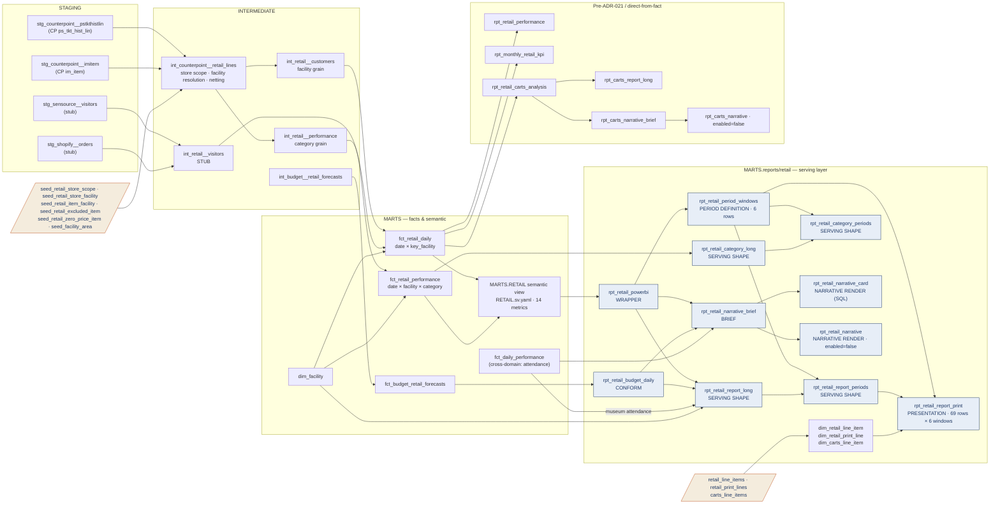

# Retail Lineage — Table Relationships & Transformations

> **Family:** `models/marts/reports/retail/` (20 models — the Retail Performance Report,
> the Carts Analysis sub-stack, and the Monthly Retail KPI rollup)
> **Source of truth:** built from the actual repo models (`ns11mm/ns11mm-data-platform`, v7.13.0)
> **Last updated:** August 2026 · Jeremy Myers, VP of AI & Analytics
> **Index:** [`LINEAGE_INDEX.md`](LINEAGE_INDEX.md) · **Role grammar:** ADR-021

The largest family in the platform and the one that exercises every ADR-021 role. It is
also the family where the DirectQuery decision is most visible: the printed grid, the
period windows, and the analyst card all exist because DirectQuery forbids the DAX
equivalents and ADR-004 leaves no other destination.

---

## End-to-end flow



Two distinct topologies live in this directory. The **wrapper chain** (blue) is the
ADR-021 pattern: semantic view → wrapper → shapes → print. The **direct-from-fact models**
(bottom) predate the grammar and read `fct_retail_daily` straight, including the whole
Carts Analysis sub-stack. That is a real inconsistency, not a drawing artifact — see
*Caveats*.

---

## Model inventory

| Model | Role | Materialization | Grain |
| --- | --- | --- | --- |
| `rpt_retail_powerbi` | Wrapper | view | date × facility |
| `rpt_retail_budget_daily` | Comparison conform | view | date × facility |
| `rpt_retail_period_windows` | Period definition | view | 6 rows (`period_code`) |
| `rpt_retail_report_long` | Serving shape | view | date × facility × line item |
| `rpt_retail_category_long` | Serving shape | view | date × facility × category |
| `rpt_retail_report_periods` | Serving shape | view | period × line item (~204 rows) |
| `rpt_retail_category_periods` | Serving shape | view | period × facility × category |
| `rpt_retail_report_print` | Presentation shape | view | period × print line (6 × 69) |
| `rpt_retail_narrative_brief` | Deterministic brief | view | 1 row / date |
| `rpt_retail_narrative_card` | Narrative render (SQL) | view | 1 row (latest date) |
| `rpt_retail_narrative` | Narrative render (Cortex) | **`enabled=false`** | 1 row / date |
| `rpt_retail_carts_analysis` | pre-ADR-021 | view | 1 row / date |
| `rpt_carts_report_long` | Serving shape | view | date × line item |
| `rpt_carts_narrative_brief` | Deterministic brief | view | 1 row / date |
| `rpt_carts_narrative` | Narrative render | **`enabled=false`** | 1 row / date |
| `rpt_retail_performance` | pre-ADR-021 | view | date × facility |
| `rpt_monthly_retail_kpi` | pre-ADR-021 | view | year × month × facility |
| `dim_retail_line_item` | Layout catalog | table | 34 rows (11 Stub) |
| `dim_retail_print_line` | Layout catalog | table | 69 rows (21 Stub) |
| `dim_carts_line_item` | Layout catalog | table | 11 rows (7 Stub) |

---

## Upstream — where the numbers come from

**`int_counterpoint__retail_lines`** is the single conformance point for CounterPoint, and
everything retail-shaped in the platform (including the DPR's retail lines) reads through
it. Three rules matter:

- **Store scope is seed-driven.** `where store_id in (select store_id from seed_retail_store_scope)`
  — currently 1, 3, 8–14. Store 1 (Museum Cafe) was added 2026-07-08. Change the seed, never
  the model.
- **Facility resolution has a precedence order** inherited from legacy `t_fact_retail`:
  `coalesce(item_override, store_fallback, 1020)`. The item override
  (`seed_retail_item_facility`) wins first — e.g. `201114 → 1040` MAG Cart,
  `201197 → 1060` MUS AG, `100564–100569 → 1080` Membership — then the store map
  (`seed_retail_store_facility`: 8/9/10 → 1003 Museum Store, 11–14 → 1020 Memorial Carts,
  3 → 1234 Ecommerce, 1 → 4007 Museum Cafe).
- **Netting happens once, by addition.** CounterPoint `R` lines carry negative `ext_price`
  and `qty`, so `net_amount` / `net_quantity` are derived here and consumed downstream
  rather than re-netted. Before 7.9.0 `int_retail__performance` netted a second time and
  overstated net sales and profit by 2× on any day with returns.

Two more seeds trim the population — `seed_retail_excluded_item` drops lines outright,
`seed_retail_zero_price_item` zeroes their amounts — and lines matching `%shipping%` are
dropped. Category normalization maps `DONATE → 'Donations'` and blanks to `'UNKNOWN'`;
`is_donation` is a flag, and downstream models filter the flag rather than the literal
summary category.

**Selling areas are always resolved by name.** `dim_facility` (built from
`seed_facility_area`) maps `key_facility → area_name / area_group / facility_group /
is_selling`, and every serving model slices on `facility_group`, never on a raw facility
number. Unmapped facilities surface as `'Unmapped ' || key_facility` rather than
disappearing.

**Two facts, two grains.** `fct_retail_daily` is date × facility; `fct_retail_performance`
is date × facility × category. Budget exists only at facility grain
(`fct_budget_retail_forecasts`), which is why the category fact carries
`net_sales_budget` / `net_profit_budget` as typed NULL — joining a facility-grain forecast
onto category rows repeated the budget on every category and inflated any rollup. That
seam is deliberately left visible.

---

## Semantic view

`cortex_project/RETAIL.sv.yaml` exposes four tables — `FCT_RETAIL_PERFORMANCE` (6 metrics),
`FCT_RETAIL_DAILY` (8 metrics), `DIM_DATE`, `SEED_FACILITY_AREA` — with four `many_to_one`
relationships (both facts → date, both facts → facility area). **14 metrics total.**

`rpt_retail_powerbi` is the only `SEMANTIC_VIEW()` caller. It projects the additive
facility-grain metrics only (net sales, net profit, net units, donation ask, transactions,
visitor count, e-com orders); the non-additive ratios are deliberately omitted and
recomputed downstream from carried components. Category-grain metrics are read directly
from `fct_retail_performance` by `rpt_retail_category_long` rather than through the wrapper
— a documented shortcut, since the category page has no budget side and no ratio lines.

---

## The serving chain in detail

### Period windows — six, defined once

`rpt_retail_period_windows` emits `CURRENT_DAY`, `SDLY`, `WTD`, `MTD`, `QTD`, `YTD` as
`[start_date .. end_date]` ranges. Three details are load-bearing:

- The as-of anchor is `max(report_date) from rpt_retail_powerbi where report_date < current_date()`
  — explicitly **not** from `rpt_retail_report_long`, whose budget side carries
  forward-dated forecast rows that would push the anchor into the future.
- `SDLY` is as-of minus **364 days** (same weekday). Contrast the DPR MTD/YTD workbooks,
  which use a calendar-year shift — both are correct for their own question.
- `WTD` computes its Sunday start explicitly (`dateadd(day, -1*dayofweek(as_of), as_of)`)
  rather than relying on the session `WEEK_START` parameter.

Pin the anchor for reconciliation with `--vars '{retail_as_of_date: "..."}'`. All windows
are calendar, not fiscal; the fiscal variant is blocked on the ADR-005 fiscal-calendar
definition.

### Ratios: carried, never stored divided

`rpt_retail_report_long` is generated from a Jinja list of five selling areas, each
declaring its additive lines and its ratio lines as `(suffix, numerator, denominator)`
tuples. A ratio row carries `numerator` and `denominator` and **no** `amount`; the division
happens once in `rpt_retail_report_periods`:

```sql
actual_value = coalesce(actual_amount, actual_numerator / nullif(actual_denominator, 0))
```

so an MTD capture rate is `sum(visitors) / sum(attendance)` over the window, not the
average of daily capture rates. Variance is blank-guarded — when budget is NULL the
variance columns are NULL, never `−100%`.

`rpt_retail_report_long` also unions in a facility-agnostic `ATTENDANCE` line
(`key_facility = NULL`) from `fct_daily_performance.mus_attendance`. That is the
cross-domain seam, and it points the opposite way from `rpt_dpr_retail_conform`, which
reaches into `fct_retail_daily` for the DPR's retail detail. Both seams are intentional
and both are single-authored.

### The printed grid, and the padding you must not clean up

`rpt_retail_report_print` cross joins 6 windows × 69 printed lines and LEFT joins the
periods grid, so a printed line with no metric behind it (Medallion Machine, which has no
facility mapping) renders NULL rather than vanishing. `scenario` selects which value
prints: actual, goal, or variance.

`dim_retail_print_line` appends occurrence-index trailing spaces to `line_item_display`:

```sql
line_item || repeat(' ', row_number() over (partition by line_item order by print_order) - 1)
```

Power BI's sort-by-column requires a 1:1 label-to-sort mapping, and the printed grid
repeats labels ('Variance' eight times, 'Revenue / Museum Visitor' four). The padding
makes them unique strings while rendering identically. **It is load-bearing.** A
well-intentioned cleanup silently breaks row order — ADR-021 records this as an accepted
negative consequence of the `*_print` role.

### Narrative chain

`rpt_retail_narrative_brief` emits one JSON object per day: eight headline lines with DoD,
WoW (−7d), YoY (−364d), MTD/YTD actual and budget, a 7-day trend direction via
`regr_slope`, and top-3 movers by budget variance and by DoD swing. `in_commemoration_window`
flags Sept 6–16 so the narrative can attribute elevated figures to the commemoration
period rather than to trend.

Two renderers read it. `rpt_retail_narrative_card` is deterministic SQL — a fixed-width
ASCII card that binds straight to a Power BI card visual under DirectQuery with no
`Value.NativeQuery` and no DAX text assembly. `rpt_retail_narrative` is the Cortex call and
is `enabled=false`, because each `SELECT` costs tokens; it documents the SQL that
`scripts/setup_retail_narrative.sql` deploys as the 05:30 ET task writing
`MARTS.RETAIL_NARRATIVE`. **Sync guard:** the task embeds a copy of the system prompt and
there is no automated drift check for that pair.

The Carts sub-stack mirrors this shape (`rpt_carts_narrative_brief` →
`rpt_carts_narrative`, `scripts/setup_carts_narrative.sql`) but deliberately **excludes**
capture rate and per-cap figures from its brief, because the LLM cannot narrate a stub.

### The Carts denominator

`rpt_retail_carts_analysis` carries a non-standard denominator inherited from the legacy
report — the "adjusted memorial visitor" figure, plaza-only foot traffic:

```sql
adj_visitors = greatest((mem_visitors - 0.25 * mem_visitors) - mus_visitors, 0)
```

All five carts ratios divide by it. `rpt_carts_report_long` deliberately does **not** read
the pre-divided ratio columns on that model — it recomputes from numerator and denominator
so monthly rollups in DAX are ratio-of-sums. The day-grain pre-divided columns stay for the
legacy surface only.

---

## Consumers

**DirectQuery.** `rpt_retail_report_periods`, `rpt_retail_category_periods` and
`rpt_retail_narrative_card` say so in their headers. `rpt_retail_period_windows` and
`rpt_retail_report_print` do not use the word, but they exist only because of that choice —
under Import they would be DAX. The remaining models carry no Import-vs-DirectQuery
statement either way.

`models/exposures.yml` carries three retail exposures — `pentaho_retail_performance_report`
(RPT-007), `pentaho_retail_carts_analysis` (RPT-008), `pentaho_monthly_retail_kpi`
(RPT-009) — all still pointing at the underlying facts rather than at the serving stack.
The registry has not been updated since the 7.12.x builds.

---

## Caveats (August 2026)

| Layer | Caveat |
| --- | --- |
| Feeds | `int_retail__visitors` is a **stub** — visitor counts and e-com order counts are zero-filled pending Sensource and Shopify. Every visitor-derived ratio in the family (capture, conversion, revenue-per-visitor, per-caps) resolves NULL by design. 11 of 34 retail line items and 7 of 11 carts line items are marked `Stub` |
| Intermediate | The return-netting sign convention (netting by addition) still needs confirmation against a real CounterPoint `R`-line extract — owner Gennady. If it is wrong the fix is one line in one model |
| Grain | Category-grain budget will stay NULL until a category-grain forecast exists. Not a defect |
| Data quality | Dev PBIX showed attendance far below the legacy PDF (Current Day 139 vs 5,322; YTD 88,978 vs 1,120,815), which cascades into every attendance-denominated ratio. Root cause traced to `fct_daily_performance.mus_attendance` in the target database, not to the retail chain — unresolved |
| Anchor | The as-of anchor can land on a partially-loaded day (observed: $0 sales, 1 customer, $528 donation ask). `retail_as_of_date` is the workaround; a permanent completeness guard on the anchor is an open question |
| History | The SDLY column is empty in dev — it needs 364 days of fact history that dev does not yet hold |
| Coverage | Page 2 of the Retail Performance Report is incomplete: the "From Audio Guide Desk" and "Museum Donations" sections of the legacy PDF are not yet modeled |
| Fidelity | Two legacy layout quirks are reproduced deliberately: the Museum Cafe donation-ask variance (legacy prints $0 where this build computes a real variance) and the Memorial Carts "Donations Goal" / "Donation Ask Actual" label asymmetry. Both need confirmation, neither is a bug |
| Consistency | `rpt_monthly_retail_kpi`, `rpt_retail_performance`, and the whole Carts sub-stack read `fct_retail_daily` directly rather than through the wrapper. Nothing is wrong with the numbers; the family simply has two topologies |
| Governance | Window definitions are not yet validated against the legacy `.prpt`. ADR-021 is `Proposed` |

---

## Related documents

- **Index:** [`LINEAGE_INDEX.md`](LINEAGE_INDEX.md)
- **The DPR's retail seam:** [`../DPR_LINEAGE.md`](../DPR_LINEAGE.md) (`rpt_dpr_retail_conform`)
- **Role grammar:** [`../../adr/ADR_021_report_serving_layer.md`](../../adr/ADR_021_report_serving_layer.md)
