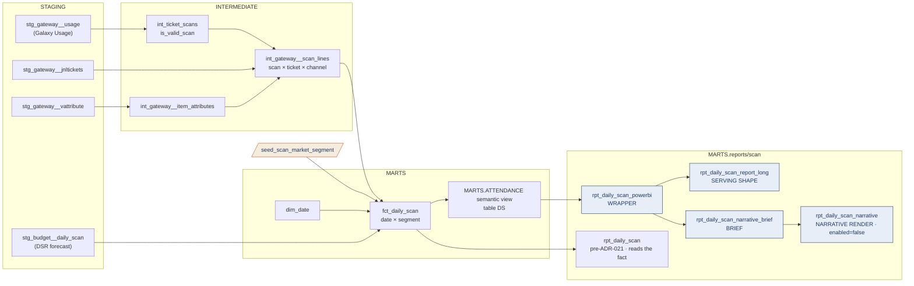

# Scan Lineage — Table Relationships & Transformations

> **Family:** `models/marts/reports/scan/` (5 models — the Daily Scan Report)
> **Source of truth:** built from the actual repo models (`ns11mm/ns11mm-data-platform`, v7.13.0)
> **Last updated:** August 2026 · Jeremy Myers, VP of AI & Analytics
> **Index:** [`LINEAGE_INDEX.md`](LINEAGE_INDEX.md) · **Role grammar:** ADR-021

The Daily Scan Report answers one question at one grain: how many passes were scanned and
tickets sold per market segment, against the DSR forecast. It is the simplest complete
ADR-021 chain in the platform — wrapper, one serving shape, a brief, and a gated narrative,
with no period-window or print models because every ratio on the report is a share that
DAX can compute from two additive lines.

---

## End-to-end flow

---

## Model inventory

| Model | Role | Materialization | Grain |
| --- | --- | --- | --- |
| `rpt_daily_scan_powerbi` | Wrapper | view | date × segment |
| `rpt_daily_scan_report_long` | Serving shape | view | date × segment × line item |
| `rpt_daily_scan_narrative_brief` | Deterministic brief | view | 1 row / date |
| `rpt_daily_scan_narrative` | Narrative render (Cortex) | **`enabled=false`** | 1 row / date |
| `rpt_daily_scan` | pre-ADR-021, reads `fct_daily_scan` | view | date × segment |

---

## Upstream — the three definitions that matter

**A valid scan.** `int_ticket_scans` sets `is_valid_scan := status_code in ('0','1')`.
`fct_daily_scan.passes_scanned` sums `scanned_qty` **only where that flag is true**;
`tickets_sold` sums `ticket_qty` with no validity filter, because a ticket's existence is
not conditional on the gate reading it. The status-code list is flagged in the model header
as needing confirmation from the attendance metric owner (ADR-005) before this feeds
anything certified.

**A market segment.** `int_gateway__scan_lines` derives
`category := coalesce(item_attributes.acs_dynamic_channel, 'Unmapped')` — the sales channel
used as a **proxy** for the legacy Galaxy market category. `fct_daily_scan` left-joins
`seed_scan_market_segment` on `category = match_value` (`match_type = 'category'`);
anything unmatched lands as `segment_key = 'unmapped'`. If the legacy category turns out to
come from a Galaxy market/reseller table that has not been seeded, that table becomes the
mapping source and this proxy retires. Flagged for confirmation.

**One ticket, one row.** `stg_gateway__jnltickets` is journal-line grain — a reissued or
adjusted ticket has several rows for one `visual_id`. `int_gateway__scan_lines` dedupes
with `qualify row_number() over (partition by visual_id order by jnl_detail_id desc) = 1`
before joining scans. Without that guard the join fans out and inflates both
`passes_scanned` and `tickets_sold` (fixed in 7.9.0).

**The forecast.** `stg_budget__daily_scan` is unpivoted into 13 segment branches and left
joined onto the fact. `passes_budget` is **NULL where no forecast row exists**, never
zero-filled, so a missing forecast reads as missing rather than as a 100% miss. The
`mobile` and `partners` budget columns are intentionally excluded — they have no
`segment_key` in the seed and no row on the legacy report.

---

## Semantic view

The scan family projects table **`DS`** of `cortex_project/ATTENDANCE.sv.yaml`
(base `MARTS.FCT_DAILY_SCAN`, primary key `(DATE_KEY, SEGMENT_KEY)` — corrected from
`(DATE_KEY)` in 7.8.0). Three dimensions (`SEGMENT_KEY`, `SEGMENT_NAME`,
`IS_COMMEMORATION_DAY`, the last carried on the fact rather than through the date table),
three facts, three metrics: `TOTAL_PASSES_SCANNED`, `TOTAL_TICKETS_SCANNED`,
`TOTAL_PASSES_BUDGET`.

Note the metric name. `TOTAL_TICKETS_SCANNED` was renamed from `TOTAL_TICKETS_SOLD` in
7.3.0 precisely so it would not be confused with the DPR's canonical `TOTAL_TICKETS_SOLD`.
They count different things and should be reconciled, not equated.

`rpt_daily_scan_powerbi` projects `report_date`, `day_name`, `segment_key`, `segment_name`,
`is_commemoration_day` and the three metrics aliased to `tickets_sold`, `passes_scanned`,
`forecast_tickets_sold`.

---

## Serving shape

`rpt_daily_scan_report_long` unpivots the wrapper into three line items —
`TICKETS_SOLD`, `FORECAST_TICKETS_SOLD`, `PASSES_SCANNED` — at date × segment × line item.

All three are additive, so the model carries **no numerator/denominator columns at all**.
That is not a shortcut: every ratio the report prints (variance %, % used, % of market) is
a ratio between two of those line items, and DAX computes it as a ratio-of-sums at whatever
grain the user picks. Contrast the today_sales family, where average sale needs a carried
denominator because transactions are not a printed line.

The unpivot is written as explicit `union all` rather than SQL `UNPIVOT`, so a segment with
a NULL forecast still gets its `FORECAST_TICKETS_SOLD` row.

The pre-ADR-021 `rpt_daily_scan` remains, reading `fct_daily_scan` directly and computing
its shares at query grain with window functions (`passes_scanned / nullif(day_total_scanned, 0)`,
`scan_utilization = passes_scanned / nullif(tickets_sold, 0)`).

---

## Narrative chain

`rpt_daily_scan_narrative_brief` anchors on
`max(report_date) where report_date < current_date()` — the Daily Scan is a **next-morning**
report covering yesterday. It emits totals, scan utilization as a ratio-of-sums
(`div0(total_scanned, nullif(total_sold, 0))`, never an average of per-segment rates), the
top three segments over and under forecast (filtered to segments that actually have a
forecast), and the top three by ticket volume.

`rpt_daily_scan_narrative` is `enabled=false` and documents the Cortex call that
`scripts/setup_daily_scan_narrative.sql` deploys as `MARTS.T_DAILY_SCAN_NARRATIVE` —
05:30 ET on `MONITORING_WH`, append-only with a `NOT IN` dedupe, **created suspended**.
Consumers read `MARTS.DAILY_SCAN_PBI_NARRATIVE`. The system prompt is duplicated verbatim
between the model and the task script with no automated drift check.

---

## Consumers & caveats (August 2026)

The scan models carry no `intraday` tag, so they run under the default 3,600-second
statement timeout rather than the 300-second intraday one. That is correct — the Daily
Scan is a daily report, not an intraday one.

| Layer | Caveat |
| --- | --- |
| Segment mapping | The sales-channel-as-market-category proxy is **provisional** and needs confirmation against the legacy Galaxy source |
| Valid scan | The `('0','1')` status-code definition needs sign-off from the attendance metric owner before certification |
| Metric naming | `TOTAL_TICKETS_SCANNED` (scan-side) and the DPR's `TOTAL_TICKETS_SOLD` are different counts of superficially the same thing. Reconcile before publishing either as "tickets sold" |
| Exposures | `pentaho_daily_scan` (RPT-010) still targets the bare fact; no exposure names the serving stack |
| Governance | ADR-021 is `Proposed` |

---

## Related documents

- **Index:** [`LINEAGE_INDEX.md`](LINEAGE_INDEX.md)
- **Sibling family on the same semantic view:** [`TODAY_SALES_LINEAGE.md`](TODAY_SALES_LINEAGE.md)
- **The other attendance surface:** [`ATTENDANCE_LINEAGE.md`](ATTENDANCE_LINEAGE.md)
