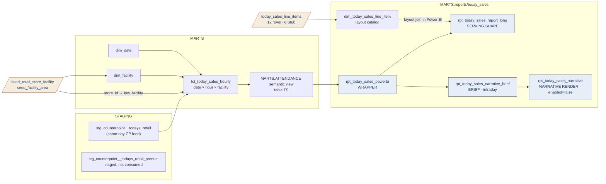

# Today's Sales Lineage — Table Relationships & Transformations

> **Family:** `models/marts/reports/today_sales/` (5 models — the Today's Sales hourly report)
> **Source of truth:** built from the actual repo models (`ns11mm/ns11mm-data-platform`, v7.13.0)
> **Last updated:** August 2026 · Jeremy Myers, VP of AI & Analytics
> **Index:** [`LINEAGE_INDEX.md`](LINEAGE_INDEX.md) · **Role grammar:** ADR-021

The only report in the platform at **hourly** grain, and the only one whose brief describes
*today* rather than yesterday. It is also the shortest chain in the platform: the fact
reads staging directly with no intermediate layer, because the same-day CounterPoint feed
arrives already shaped.

---

## End-to-end flow

`stg_counterpoint__todays_retail_product` is staged but **not consumed** — it exists for a
future product-level breakout. Nothing downstream reads it today.

---

## Model inventory

| Model | Role | Materialization | Grain |
| --- | --- | --- | --- |
| `rpt_today_sales_powerbi` | Wrapper | view | date × hour × facility |
| `rpt_today_sales_report_long` | Serving shape | view | date × hour × facility × line item |
| `rpt_today_sales_narrative_brief` | Deterministic brief | view | 1 row (today) |
| `rpt_today_sales_narrative` | Narrative render (Cortex) | **`enabled=false`** | 1 row / date |
| `dim_today_sales_line_item` | Layout catalog | table | 12 rows (6 Stub) |

---

## Upstream

`fct_today_sales_hourly` reads `stg_counterpoint__todays_retail` directly — bronze to gold
with no silver model, the only fact in the platform built that way. It is justified by the
feed's shape: the same-day extract already carries one row per ticket line with an hour on
it.

- **Hour buckets are not computed.** `hour_of_day` comes straight from the feed's
  `tkt_hour` column. There is no bucketing logic in dbt to get wrong.
- **Facility resolution reuses the retail seeds.** `store_id → key_facility` via
  `seed_retail_store_facility`, then `key_facility → area_name` via `dim_facility`.
  Unmatched stores land at `key_facility = -1` and `area_name = 'Unmapped'` rather than
  NULL, so they are countable. A non-zero count of `-1` rows is a documented data-quality
  watch query.
- **Measures:** `transactions = count(distinct doc_id)`, `units = sum(quantity_sold)`,
  `profit = sum(sales) - sum(cost)`. All additive.

Note that this family's `key_facility` is the retail selling-area surrogate. It is a
different concept from the Gateway facility used by the attendance and scan families, which
happens to share the word.

---

## Semantic view

The family projects table **`TS`** of `cortex_project/ATTENDANCE.sv.yaml`
(base `MARTS.FCT_TODAY_SALES_HOURLY`, added in semantic-view 1.6.0). Three dimensions
(`HOUR_OF_DAY`, `KEY_FACILITY`, `AREA_NAME`), five facts, four metrics:
`TOTAL_TODAY_SALES`, `TOTAL_TODAY_PROFIT`, `TOTAL_TODAY_UNITS`,
`TOTAL_TODAY_TRANSACTIONS`. The `COST` fact is carried but has no metric over it.

Today's Sales is deliberately **excluded from `UNIFIED`** — that view spans the four live
day-grain facts, and an hourly grain does not belong in it.

---

## Serving shape — three kinds of line, and why

`rpt_today_sales_report_long` is generated from three Jinja loops, and the difference
between them is the clearest illustration of the ADR-021 ratio and placeholder rules in one
model:

| Kind | Line items | `amount` | `numerator` / `denominator` |
| --- | --- | --- | --- |
| **Additive** | `SALES`, `PROFIT`, `QTY_SOLD`, `TICKET_COUNT` | populated | NULL |
| **Ratio** | `AVG_SALE` (sales ÷ transactions), `AVG_QTY` (units ÷ transactions) | NULL | populated |
| **Stub** | `STORE_VISITORS`, `ATTENDANCE`, `TOTES_SOLD`, `CONVERSION`, `CAPTURE`, `TOTES_PCT_GUESTS` | typed NULL | typed NULL |

The ratio lines carry components rather than a quotient, so an hour-of-day average sale and
a whole-day average sale are both ratios-of-sums. The stub lines are typed NULL with a
stated reason — *no data feed*: there is no intraday visitor count and the tote SKU is
unflagged. They match the six `availability = 'Stub'` rows in the seed exactly, so the
report renders every printed line greyed rather than dropping it.

There are **no budget columns anywhere in this family**. The report has no goals, and
ADR-021's placeholder rule applies to columns that exist in the legacy artifact — a budget
never did.

---

## The intraday brief, and the honest comparison it makes

`rpt_today_sales_narrative_brief` anchors on `current_date()`, not on yesterday. It emits
zero rows before the first same-day feed lands.

Its baseline is the **same weekday last week, full day** — not day-to-date. That asymmetry
is deliberate and it is labelled in the JSON itself:
`'framing': 'intraday day-to-date vs same weekday last week full-day total'`, with the key
named `vs_last_week_day_total`. The system prompt then requires the narrative to say "so
far today" versus "last Tuesday's full day" and forbids framing the gap as a like-for-like
shortfall. Comparing a partial day to a full one is the correct available comparison; what
would be wrong is describing it as anything else.

`rpt_today_sales_narrative` is `enabled=false` and documents the Cortex call deployed by
`scripts/setup_today_sales_narrative.sql` as `MARTS.T_TODAY_SALES_NARRATIVE`.

---

## Caveats (August 2026)

| Layer | Caveat |
| --- | --- |
| **Schedule mismatch** | The narrative task fires **once at 05:30 ET**, the same schedule as the daily reports — on an intraday day-to-date brief that captures essentially the pre-opening state. The setup script documents why: hourly firing needs the append-only `NOT IN` dedupe replaced with delete-and-insert for the current date, which has not been decided. This is the family's most consequential open item |
| **No `intraday` tag** | Despite being intraday throughout, no model here carries the `intraday` tag, so none picks up the 300-second statement timeout in `dbt_project.yml`. The tag currently exists only on `fct_ticket_availability`. Intent and configuration have drifted |
| Feeds | Store visitors, attendance, and totes have no intraday feed — six line items are Stub |
| Coverage | The Memorial Cart 1/2/3 split is an open sign-off gate; it needs `store_id` retained on `fct_today_sales_hourly`, a small fact change held for a separate PR |
| Exposures | `pentaho_todays_sales_hourly` (RPT-006) targets the fact plus `rpt_retail_performance`, not this serving stack |
| Governance | ADR-021 is `Proposed` |

---

## Related documents

- **Index:** [`LINEAGE_INDEX.md`](LINEAGE_INDEX.md)
- **Sibling family on the same semantic view:** [`SCAN_LINEAGE.md`](SCAN_LINEAGE.md)
- **Where the retail facility seeds come from:** [`RETAIL_LINEAGE.md`](RETAIL_LINEAGE.md)
