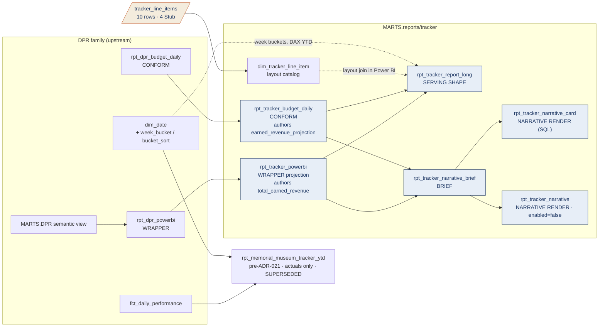

# Tracker Lineage — Table Relationships & Transformations

> **Family:** `models/marts/reports/tracker/` (8 models — the Memorial & Museum Daily
> Tracker YTD)
> **Source of truth:** built from the actual repo models (`ns11mm/ns11mm-data-platform`, v7.13.0)
> **Last updated:** August 2026 · Jeremy Myers, VP of AI & Analytics
> **Index:** [`LINEAGE_INDEX.md`](LINEAGE_INDEX.md) · **Role grammar:** ADR-021

The Tracker is the family that proves ADR-021's central claim. It has no fact, no semantic
view and no intermediate models of its own: it is **entirely** a projection off the DPR's
wrapper and budget conform. ADR-021 §2 nonetheless keeps it in its own directory, because
it is a distinct printed artifact with its own layout catalog. Families are report
clusters, not domains.

---

## End-to-end flow

Note the two parallel paths. The `rpt_tracker_*` stack is the live Power BI build.
`rpt_memorial_museum_tracker_ytd` reads `fct_daily_performance` directly, carries actuals
only with no projection columns at all, and is explicitly **superseded** — kept for
existing consumers, not extended.

---

## Model inventory

| Model | Role | Materialization | Grain |
| --- | --- | --- | --- |
| `rpt_tracker_powerbi` | Wrapper (projection off `rpt_dpr_powerbi`) | view | 1 row / date |
| `rpt_tracker_budget_daily` | Comparison conform | view | 1 row / date |
| `rpt_tracker_report_long` | Serving shape | view | date × line item |
| `rpt_tracker_narrative_brief` | Deterministic brief | view | 1 row / date |
| `rpt_tracker_narrative_card` | Narrative render (SQL) | view | 1 row (latest) |
| `rpt_tracker_narrative` | Narrative render (Cortex) | **`enabled=false`** | 1 row / date |
| `dim_tracker_line_item` | Layout catalog | table | 10 rows (4 Stub) |
| `rpt_memorial_museum_tracker_ytd` | pre-ADR-021, superseded | view | 1 row / date |

---

## The two composites

The Tracker's whole reason for existing is one number on each side, and each is authored
**exactly once** (7.12.1):

**`total_earned_revenue`**, on `rpt_tracker_powerbi`, sums 20 `coalesce(x, 0)` components —
admission revenue, five tour lines, store / carts / cafe profit, audio, and ten donation
lines. It mirrors the DPR's `TOTAL_ESTIMATED_REVENUE` composite exactly. The `coalesce` is
deliberate: without it a single missing feed NULLs the entire composite and blanks a
printed line, which is exactly the defect 7.12.1 found in the DPR chain.

**`earned_revenue_projection`**, on `rpt_tracker_budget_daily`, sums only the budgeted
components. Donations and virtual-tour revenue are excluded by construction — they carry
typed NULL on the budget side, with the stated reason "not in the budget."

Downstream models **consume** these columns. Neither `rpt_tracker_report_long` nor
`rpt_tracker_narrative_brief` re-authors the sum. That is the composites rule of ADR-021
correctly applied, and it is worth contrasting with the DPR family, where
`TOTAL_ESTIMATED_REVENUE` is currently authored twice.

---

## Serving shape

`rpt_tracker_report_long` full-outer-joins an actual unpivot and a projection unpivot on
`(report_date, line_item_code)`. It differs from the DPR and Retail matrices in one
structural way worth knowing before you read the output: **the Tracker prints the
projection as its own row**, not as a second column on the actual's row.
`TOTAL_EARNED_REVENUE` and `EARNED_REVENUE_PROJECTION` are two distinct `line_item_code`
values, not one row with `amount` and `budget_amount`. That is how the legacy printed
artifact reads, and the layout catalog is built to match.

Line items: seven on the actual side (`TOTAL_EARNED_REVENUE`, `MEMORIAL_ATTENDANCE`,
`TICKETS_SOLD`, `TOTAL_MEMORIAL_REVENUE`, `TOTAL_MUSEUM_REVENUE`, `REV_PER_CAP_MEMORIAL`,
`REV_PER_CAP_MUSEUM`) and three on the projection side.

**The revenue split is the family's one open seam.** Four of the ten line items —
`TOTAL_MEMORIAL_REVENUE`, `TOTAL_MUSEUM_REVENUE`, and the two per-caps that divide by them
— are `availability = 'Stub'` in the seed and typed NULL in the model. Splitting earned
revenue between the memorial and the museum is an unresolved ADR-005 business rule pending
the Data & AI Committee. Note that the ratio lines still carry `denominator`
(`memorial_attendance` / `museum_attendance`) with a NULL `numerator` — the shape is
already correct, so the rows light up the day the rule lands, with no report change. The
same rule blocks two columns in `rpt_dpr_excel_export`.

---

## YTD, three different ways

This trips people up, so it is worth stating plainly. The Tracker computes year-to-date in
three different places by three different mechanisms, and that is intentional:

| Where | Mechanism | Why |
| --- | --- | --- |
| `rpt_tracker_report_long` → Power BI | **DAX time intelligence** over `dim_date` | The live build. Nothing is materialized per period, so any window the user picks works |
| `rpt_tracker_narrative_brief` | Filtered `SUM` where `year(report_date) = year(as_of)` and `report_date <= as_of` | The brief needs one scalar per measure, not a series |
| `rpt_memorial_museum_tracker_ytd` | `sum(...) over (partition by year_number order by date_value)` | The superseded model's own windowed cumulative |

All three partition by **calendar** year. A fiscal-year variant is pending the ADR-005
fiscal-calendar definition. (An older CHANGELOG entry describes the legacy model as a
"fiscal-YTD variance tracker" — that description is stale; the code partitions by
`year_number` and carries no budget at all.)

---

## Week buckets — where the logic actually lives

The Tracker's attendance matrix buckets days into rolling Monday–Sunday weeks. Follow the
history, because the obvious place to look no longer exists:

- **7.12.1** added `rpt_tracker_week_bucket`, a view computing the buckets at query time.
- **7.12.2** folded the logic into `dim_date` as `week_bucket` (string label) and
  `bucket_sort` (sortable date), anchored at **build time** on yesterday in
  `America/New_York`. The reason was DirectQuery relationship-folding trouble with a second
  date-grain table; with the columns on `dim_date` the matrix needs no extra relationship.
- **7.13.0** finally deleted the orphaned file — 7.12.2's `APPLY.sh` removal never ran, so
  it lingered for two releases. The matching
  `DROP VIEW IF EXISTS MARTS.RPT_TRACKER_WEEK_BUCKET` ships in the 7.13.0 release payload's
  `snowflake/01_apply.sql`, not in this repo; if that release was not applied to your
  environment, the orphaned view is still in Snowflake.

The current logic in `dim_date`: the anchor week and the two prior render as
`'MM/DD - MM/DD'`; anything after the current week-end renders `'Future'`; prior calendar
years render `'Prior Years'`; everything else this year renders `'1/1 - MM/DD'`.
`bucket_sort` mirrors it with real week-start dates and two sentinels (`9999-01-01` for
Future, `1900-01-01` for Prior Years) so the sort is stable.

---

## Narrative chain

`rpt_tracker_narrative_brief` emits one JSON object per day: YTD earned revenue,
memorial attendance, museum attendance and tickets sold — each as actual, projection, and
variance — plus a 7-day direction flag per measure from `regr_slope`. Variance percentages
use `div0(actual - projection, nullif(abs(projection), 0))`.

`rpt_tracker_narrative_card` renders it as a fixed-width ASCII card in pure SQL, and
generates its own watch items deterministically: any measure trending down over 7 days, or
YTD earned revenue / museum attendance more than 5% off projection. It works whether or not
the Cortex task is running.

`rpt_tracker_narrative` is `enabled=false` and documents the Cortex call that
`scripts/setup_tracker_narrative.sql` deploys as `MARTS.T_TRACKER_NARRATIVE` (05:30 ET,
`MONITORING_WH`, **created suspended**). Consumers read `MARTS.TRACKER_PBI_NARRATIVE`.
The task embeds a copy of the system prompt — edit both or neither.

---

## Consumers

**DirectQuery**, chosen deliberately so the report never races the nightly load. That
choice is why the week-bucket labels and the ASCII card live in SQL rather than in DAX.

`rpt_tracker_powerbi`, `rpt_tracker_report_long` and `rpt_tracker_narrative_card` narrow
their grants to `POWERBI_ROLE` only; the rest inherit the project default of
`POWERBI_ROLE` + `ML_ROLE`.

---

## Caveats (August 2026)

| Layer | Caveat |
| --- | --- |
| Business rule | The memorial-vs-museum revenue split (ADR-005) blocks 4 of 10 line items. The shape is built; only the rule is missing |
| Stale comment | `rpt_memorial_museum_tracker_ytd` omits `cafe1_donations` from its donation total, with a comment saying the column is "not surfaced in `fct_daily_performance` yet." **That is no longer true** — the fact carries `cafe1_donations`. Either add it to the legacy model's total or drop the comment; leaving both is how a stale note becomes a believed fact |
| Exposures | `models/exposures.yml` carries only `pentaho_memorial_museum_daily_tracker_ytd` (RPT-005), pointing at `fct_daily_performance` — i.e. at the superseded path. No exposure names the live `rpt_tracker_*` stack |
| Watch items | `rpt_tracker_narrative_card` checks the 5% threshold for earned revenue and museum attendance only, not for memorial attendance or tickets sold. Not documented either way — treat as unconfirmed scope, not as intent |
| Governance | ADR-021 is `Proposed`. §3 is the rule that permits this family to exist at all as a projection off another family's wrapper |

---

## Related documents

- **Index:** [`LINEAGE_INDEX.md`](LINEAGE_INDEX.md)
- **Everything upstream of this family:** [`../DPR_LINEAGE.md`](../DPR_LINEAGE.md)
- **Role grammar:** [`../../adr/ADR_021_report_serving_layer.md`](../../adr/ADR_021_report_serving_layer.md)
