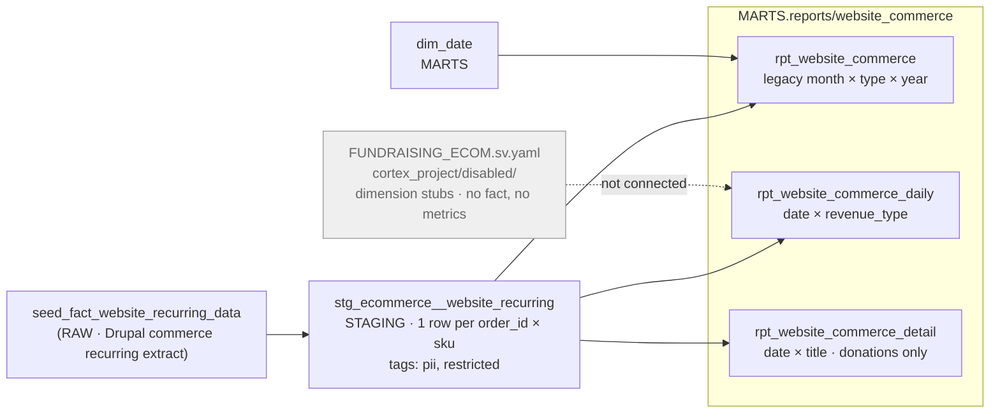

# Website Commerce Lineage — Table Relationships & Transformations

> **Family:** `models/marts/reports/website_commerce/` (3 models — the Website Commerce Report)
> **Source of truth:** built from the actual repo models (`ns11mm/ns11mm-data-platform`, v7.13.0)
> **Last updated:** August 2026 · Jeremy Myers, VP of AI & Analytics
> **Index:** [`LINEAGE_INDEX.md`](LINEAGE_INDEX.md) · **Role grammar:** ADR-021

The shallowest chain in the platform — one staging model feeding three presentation views,
with no intermediate layer, no fact, no budget and no narrative. It is also the only family
whose serving models predate the role grammar entirely and adopt none of its suffixes.

---

## End-to-end flow



---

## Model inventory

| Model | Role | Materialization | Grain |
| --- | --- | --- | --- |
| `rpt_website_commerce` | pre-ADR-021 (legacy pivot input) | view | month × revenue type × year |
| `rpt_website_commerce_daily` | pre-ADR-021 (`_daily` is not a role suffix) | view | date × revenue type |
| `rpt_website_commerce_detail` | pre-ADR-021 (`_detail` is not a role suffix) | view | date × title (donations only) |

None of the three carries an ADR-021 suffix. That is a real gap rather than a naming
accident: the family was built before the grammar and has not been revisited. If it is ever
brought into the pattern, `rpt_website_commerce_daily` is a `*_report_long` and
`rpt_website_commerce_detail` is a second serving shape.

---

## Upstream

`stg_ecommerce__website_recurring` conforms `seed_fact_website_recurring_data` — the Drupal
commerce recurring donation and membership extract — with rename and recast only: order and
SKU keys, title, order type and status, `try_to_timestamp` on the three date columns,
typed quantity and revenue, and the purchase-order comment. It carries `email` and is
tagged `['pii', 'restricted']`.

The source definition in `models/raw/sources.yml` carries its own open note — "confirm `_db`
vs `_d8`" — on which Drupal table the extract actually comes from.

**None of the three report models projects `email` or `order_id`.** They select aggregates
only, so no masking surface is created downstream of staging. That is the intended handling
under `DATA_CLASSIFICATION.md`, and it is worth preserving if the models are ever extended.

### The revenue-type rule

One rule, authored once and copied verbatim into all three models, with headers saying
plainly: do not fork it.

```sql
case
    when lower(coalesce(order_type,'')) like '%member%'
      or lower(coalesce(title,''))      like '%member%' then 'Membership'
    when lower(coalesce(order_type,'')) like '%don%'
      or lower(coalesce(title,''))      like '%don%'    then 'Donation'
    else coalesce(order_type, 'Other')
end
```

This is a **heuristic over an open set**, not a governed reference table. A new order type
whose name contains neither string falls through to `'Other'` and quietly changes what the
report totals. It is the single largest correctness risk in this family, and the obvious
remediation — a seeded mapping under the ADR-005 metric gate — is not yet done.

Every model filters `where created_at is not null`.

---

## The three shapes

**`rpt_website_commerce`** is the legacy input, one row per month × revenue type × year,
joined to `dim_date` for the year and month labels. Its grain is enforced by an in-model
`GROUP BY` and asserted by an error-severity uniqueness test on the composite key.

There is **no `PIVOT` in this SQL**. The legacy month-columns-by-year matrix is
reconstructed entirely in Power BI from this long output. The join to `dim_date` is an
inner join, so a `created_at` outside the 2000–2035 spine would be dropped silently —
not a realistic risk, but the mechanism is there.

**`rpt_website_commerce_daily`** supersedes the month pivot for the Power BI rebuild:
day grain, so periods live in DAX over `dim_date` and are never materialized in SQL. It
covers both legacy workbook variants ("By Month" / "By Date") from one model.

One column deserves attention: **`is_recurring` is a hardcoded literal `true`** on every
row, because the recurring extract is the only live feed. The header states the intended
extension — when the one-time feed lands, add its leg with `is_recurring = false` and both
variants light up with no Power BI change. Note this is a hardcoded boolean rather than a
typed NULL placeholder; the ADR-021 convention arrived later and has not been applied here.

**`rpt_website_commerce_detail`** is the "Donations By Date" sheet: day × title, filtered
to `revenue_type = 'Donation'`. Membership and other rows are excluded, not relabelled.

---

## Semantic view — none

`report_semantic_view_map.md` maps this report to `fundraising_ecom`, annotated as a
scaffold in `cortex_project/disabled/`. Reading that file confirms the annotation
understates it: `FUNDRAISING_ECOM.sv.yaml` contains five dimension tables
(`DIM_CAMPAIGN`, `DIM_CUSTOMER`, `DIM_FUND`, `DIM_PAYMENT_METHOD`, `DIM_DATE`), all awaiting
RAW connections, and **no fact table, no `metrics:` block and no `relationships:` block**.
It does not reference `stg_ecommerce__website_recurring` or any of the three report models.

So the one family in this set with a real, non-stub feed has **no Cortex Analyst surface at
all** — not a disabled-but-complete one, an unbuilt one. It is also excluded from `UNIFIED`
on monthly-grain grounds. Both facts are true; the second is the reason usually given and
the first is the one that would actually need work.

---

## Narrative — none, deliberately

No narrative models, no setup script. 7.12.0 records the reasoning: a monthly cadence does
not warrant a daily note. Revisit if the report becomes a daily subscription. This is the
one family that got the design question asked and answered rather than defaulted.

---

## Caveats (August 2026)

| Layer | Caveat |
| --- | --- |
| **Revenue type** | The Donation / Membership split is an ungoverned string heuristic. Anything unmatched falls to `'Other'` |
| Feed | `is_recurring` is hardcoded `true`; the one-time website feed is an open seam in both `_daily` and `_detail` |
| Source | `models/raw/sources.yml` still carries an unresolved "confirm `_db` vs `_d8`" note on the extract |
| PII | `email` lives in staging (tagged `pii`, `restricted`) and is deliberately not projected. Keep it that way |
| Semantic | `fundraising_ecom` is an inert dimension-only scaffold — no fact, no metrics |
| Exposures | `pentaho_website_commerce_report` (RPT-013) depends on the legacy pivot model only, and its description still reads "STUB: Classy / Shopify recurring feed pending external register ADR-008." That description is **stale** — the Drupal recurring feed is live. The exposure needs updating |
| Grain | The family is split: one monthly model, two daily. Not a defect, but a surprise if you assume uniform grain |
| Governance | Three models, zero ADR-021 role suffixes |

---

## Related documents

- **Index:** [`LINEAGE_INDEX.md`](LINEAGE_INDEX.md)
- **PII handling:** [`../DATA_CLASSIFICATION.md`](../DATA_CLASSIFICATION.md)
- **Role grammar:** [`../../adr/ADR_021_report_serving_layer.md`](../../adr/ADR_021_report_serving_layer.md)
